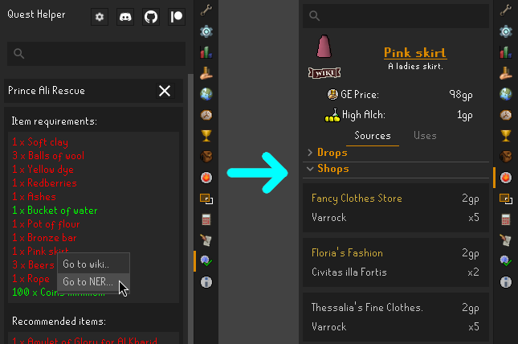
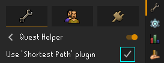
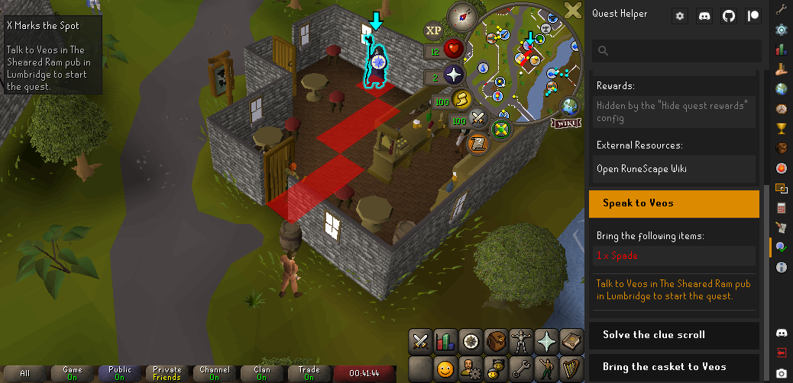

# Runelite Quest Helper plugin

This plugin is intended to assist in completing quests, from showing you quest steps, where to go, items needed, puzzles solutions, and more.

## Using the Quest Helper

Firstly, download the Quest Helper from the Runelite Plugin Hub.

You should then see the quest helper icon appear in the Runelite sidebar. You can click it to see a list of all quests which you've yet to complete. Select the icon quest you're wanting to do, and the helper for that quest will start up.

Once the quest is started, the sidebar will change to show the requirements for the quest, as well as listing all the steps you'll need to complete to finish the quest. In the top-left corner the current step is displayed. The world map will display an arrow to where you need to go, the minimap an arrow to the location, and the object, NPC, or tile you need to go to will be highlighted as seen below.

At this stage, simply follow the steps until you've completed the quest!

## Other plugins

Quest Helper works together with other plugins to give a nice unified experience while questing.

### Not Enough Runes

If you have the [Not Enough Runes](https://runelite.net/plugin-hub/show/not-enough-runes) plugin installed, you can
right-click item requirements and click `Go to NER...` to look that item up in Not Enough Runes.

### Shortest Path

If you have the [Shortest Path](https://runelite.net/plugin-hub/show/shortest-path) plugin installed, you can enable the
the "Use 'Shortest Path' plugin" in the Quest Helper config.

Next time you start a quest, the Shortest Path plugin will help you take the shortest path to the destination.

You can configure what teleportation methods, or the aesthetic of the path in the Shortest Path config.

## Help and discussion

If you've experienced an issue with a quest helper, or have a recommendation on how to improve it, please [create an issue](https://github.com/Zoinkwiz/quest-helper/issues/new) with the relevant details.

In addition, there's a [Discord](https://discord.gg/XCfwNnz6RB) you can use for discussion and raising issues.

## Contributing

Check out the [Contribution Guide](https://github.com/Zoinkwiz/quest-helper/wiki/Contribution-guide) for help with making changes and adding your own helpers.

## Donating

If you'd like to donate to help support development, there is a [Patreon](https://www.patreon.com/zoinkwiz) you can use,
or a [PayPal](https://paypal.com/donate?hosted_button_id=HSSLPZCSZELDW) for one-off donations.
